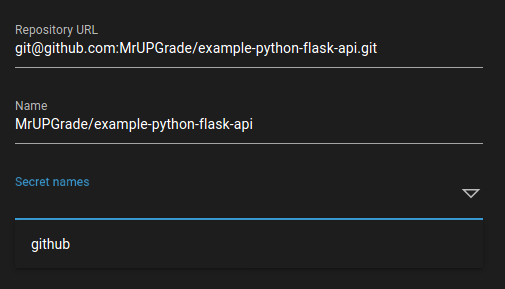
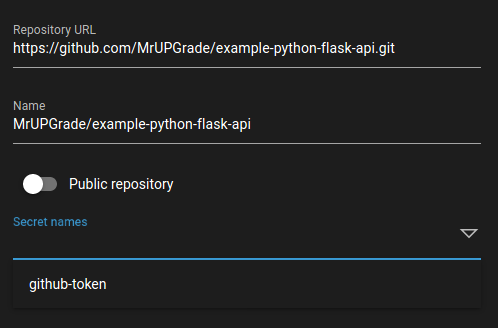

.. _secrets-desc:

Secrets
*******

Overview
++++++++

Secrets are objects in IceCI responsible for storing sensitive data. They are stored as *secrets* in Kubernetes cluster. Currently ``IceCI`` distinguishes 4 types of secrets:

  * :ref:`generic secret<generic-secret-desc>`
  * :ref:`docker secret<docker-secret-desc>`
  * :ref:`git ssh key secret<git-ssh-key-secret-desc>`
  * :ref:`git token secret<git-token-secret-desc>`

.. attention::
  ``git ssh key`` and ``git token`` secret types are used for cloning the repository and are never directly referred to in the pipelines. They can be only used while creating repositories in the ``UI``.

.. note::
  Currently ``secrets`` can only be configured through the ``UI`` in the ``settings`` section.

.. _generic-secret-desc:

Generic secret
++++++++++++++

Generic secrets store sensitive data that can be used in pipelines. Those values can be passed as environment variables to containers. Generic secrets can be used in :attr:`containerRun<ContainerRun>` steps, :attr:`services<Service>` and :attr:`failure handlers<FailureHandler>`. They can be also defined in the :attr:`global<globals>` scope of the pipeline.

Example
_______

Here's an example of passing a value from ``generic-secret`` as an environment variable ``ENV_FROM_SECRET``.

.. code-block:: yaml

  steps:
  - name: step1
    containerRun:
      image: busybox
      script: |
        printenv ENV_FROM_SECRET
      environment:
      - name: ENV_FROM_SECRET
        fromSecret: generic-secret

Here's an example of passing a value from ``generic-secret`` to both :attr:`service<Service>` and :attr:`containerRun<ContainerRun>` step in the pipeline via the :attr:`global<globals>` section.

.. code-block:: yaml

  globals:
    environment:
    - name: ENV_FROM_SECRET
      fromSecret: generic-secret

  services:
  - name: envcheck
    image: busybox
    script: |
      printenv ENV_FROM_SECRET
      sleep 99999

  steps:
  - name: step1
    containerRun:
      image: busybox
      script: |
        printenv ENV_FROM_SECRET

Further reading
_______________

For more information about passing secrets as environment variables see :attr:`environment variable<EnvironmentVariable>` reference.

.. _docker-secret-desc:

Docker secret
+++++++++++++

Overview
________

A Docker secret stores credentials used to communicate with docker registries. It can be used for both downloading images from private registries as well as pushing images after building them in the :attr:`containerBuild<ContainerBuild>` step. In both cases the ``dockerSecret`` field is used.

A Docker secret can also be specified in the :attr:`globals<Globals>` section of the pipeline - this way it'll be passed to every object that has a ``dockerSecret`` field. If a Docker secret is specified at the object level, it will override the global docker secret.

Examples
________

Here's an example of using a Docker image from a private registry to run both the :attr:`service<Service>` and :attr:`step<Step>` in the pipeline.

.. code-block:: yaml

  services:
  - name: db
    image: mrupgrade/private:db
    dockerSecret: dockerhub

  steps:
  - name: step1
    containerRun:
      image: mrupgrade/private:debian10
      dockerSecret: dockerhub
      script: "echo Hello world"

.. note::

  While running this example in your own pipelines, remember to change the ``image`` value into a repository and image that you have read access to. You also need to create a correct Docker secret with name **dockerhub**.

Here's an example of setting up ``dockerSecret`` at the global level so it doesn't have to be repeated in every :attr:`step<Step>`, :attr:`service<Service>` and :attr:`failure handler<FailureHandler>`.

.. code-block:: yaml

  globals:
    dockerSecret: dockerhub

  services:
  - name: db
    image: mrupgrade/private:db

  steps:
  - name: step1
    containerRun:
      image: mrupgrade/private:debian10
      script: "echo Hello world"

.. note::

  While running this example in your own pipelines, remember to change the ``image`` value into a repository and image that you have read access to. You also need to create a correct Docker secret with name **dockerhub**.

Further reading
_______________

For more information on how to use Docker secrets check the reference for these pipeline objects: :attr:`containerRun<ContainerRun>`, :attr:`containerBuild<ContainerBuild>`, :attr:`service<Service>`,  :attr:`failureHandler<FailureHandler>` and :attr:`globals`.

.. _git-ssh-key-secret-desc:

Git SSH key
+++++++++++

A Git SSH key stores a SSH key used to communicate with a Git server. It's used for cloning the repository and monitoring any changes that may occur.

The secret is specified while adding a repository to ``IceCI``. After entering a SSH clone URL in the ``Repository URL`` field - for example ``git@github.com:MrUPGrade/example-python-flask-api.git`` - the ``Secret names`` dropdown will show you all the available Git SSH secrets.

.. note::

  Git SSH keys are used whenever the access to repository is via ``ssh`` regardless if it's *public* or *private* repository.

.. _git-token-secret-desc:

Git token
+++++++++

A Git token stores a token used to communicate with the Git server. It's used for cloning the repository and monitoring any changes that may occur.

The secret is specified while adding a repository to ``IceCI``. After entering a HTTP clone URL in the ``Repository URL`` field - for example ``https://github.com/MrUPGrade/example-python-flask-api.git`` - the ``Secret names`` will dropdown list you all the available Git token secrets.

.. note::

  A Git token is used only when accessing a private repository via ``https``. For public ``https`` repositories the token can be skipped and no secrets are needed.

