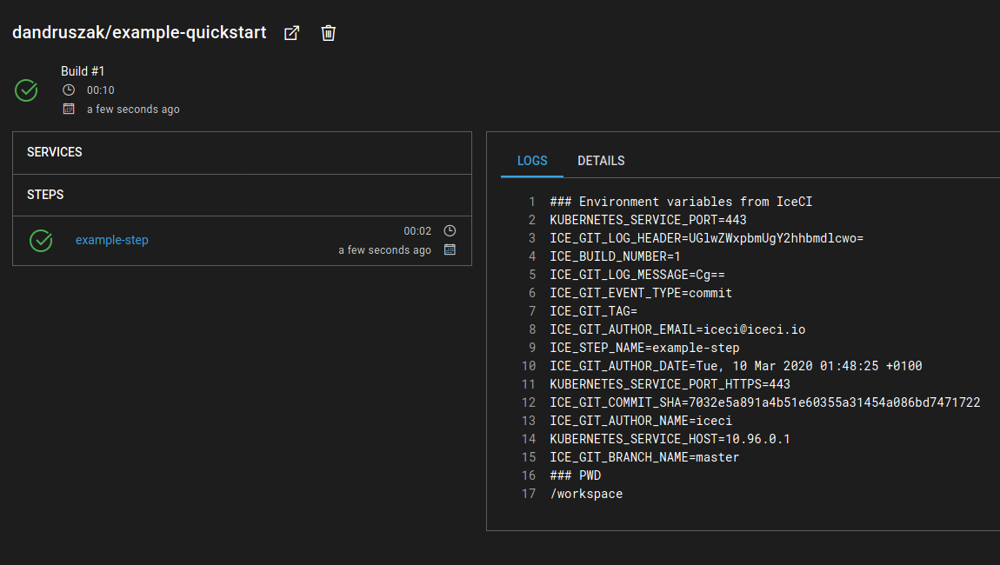

Quickstart
##########

This tutorial will help you install IceCI in your Kubernetes cluster and set up your first pipeline using an example repository in less than 15 minutes. Let's start integrating!

.. note::
    To make this quickstart guide *actually* quick we'll fork an example public repository, so no secret configuration will be needed.

Prerequisites
-------------

Before installing IceCI you'll need to have access to a Kubernetes cluster. If you're using an existing cluster in the cloud or on-premise, you're pretty much good to go. You can also launch IceCI in a local cluster using `Minikube <https://kubernetes.io/docs/setup/learning-environment/minikube/>`_ or `K3s <https://k3s.io/>`_ with `k3sup <https://github.com/alexellis/k3sup>`_. In that case just follow the installation instructions provided by the respective documentation.

.. note::
    When using Minikube you will need to enable the ingress addon to be able to reach the UI. It can be enabled with ``minikube addons enable ingress``. For more information please refer to the `documentation <https://kubernetes.io/docs/tasks/access-application-cluster/ingress-minikube/>`_.

Installing and running IceCI
----------------------------

Prepare an IceCI namespace
**************************

.. note::
    This step is optional - if you'd rather run IceCI in the default namespace, go ahead and skip to the next step.

Create a namespace in which IceCI will operate and update your kubectl config to use that namespace.

.. code-block:: bash

    kubectl create ns iceci
    kubectl config set-context --current --namespace=iceci

Installing IceCI
****************

You can use a handy all-in-one manifest to install IceCI. Applying it in your cluster will set up all the necessary objects to run the applications.

.. code-block:: bash

  kubectl apply -f https://raw.githubusercontent.com/IceCI/IceCI/master/manifests/crds.yaml
  kubectl apply -f https://raw.githubusercontent.com/IceCI/IceCI/master/manifests/minikube.yaml

Once all the applications are running, you're all ready to go.

.. note::
    Apart from the minikube file, kustomize files for all components, and examples of setup can be found as separate files in the IceCI `GitHub repository <https://github.com/IceCI/IceCI>`_

Configuring the repository
**************************

Now you can access the UI through your browser and add a repository to start running pipelines. To do that, simply click the ``+`` button on the top of the left navigation bar and create a new repository using the form.

.. note::
    When using Minikube, you can open the UI by running command ``minikube service iceci-web``

.. image:: ../_static/quickstart/repo_add.png

For the purposes of this guide, we'll fork the `quickstart example repository <https://github.com/IceCI/example-quickstart>`_. After forking this repository, all you need to do is copy the clone url and paste it into the `Repository URL` field in the form.

.. note::
    The example repository is also a template, so instead of forking you can use it to create a new one!

Once the repository is added to IceCI you're all set. IceCI will react to Git events, so all that's left is to push a commit to trigger a new pipeline. Try it for yourself!

Next steps
**********

As you can see, the example pipeline is very simple - just to get you acquainted with the structure of the config file. For more information about the configuration file - check out the :doc:`Pipelines <pipelines/overview>` section of the documentation. We've also prepared couple of small example applications along with a ready pipeline which you can find on github:

* `Python Flask API <https://github.com/IceCI/example-python-flask-api>`_
* `Go Gin API <https://github.com/IceCI/example-go-gin-api>`_
